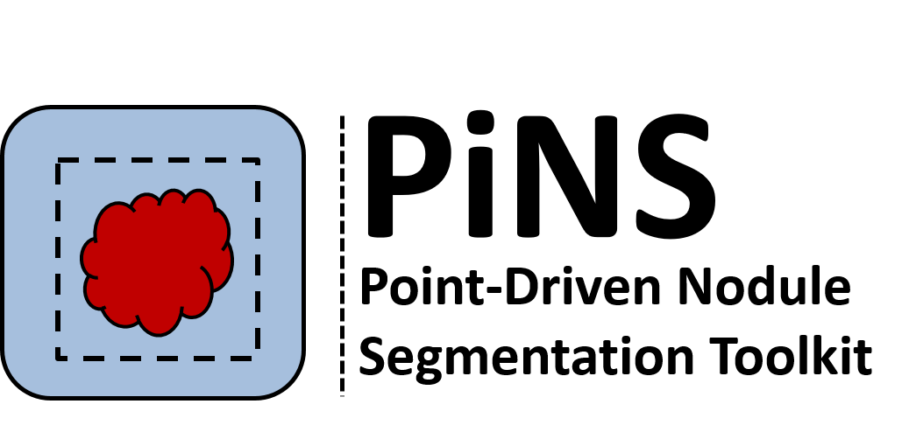
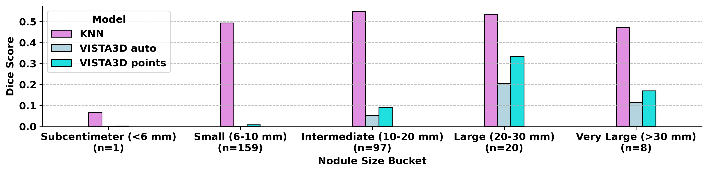
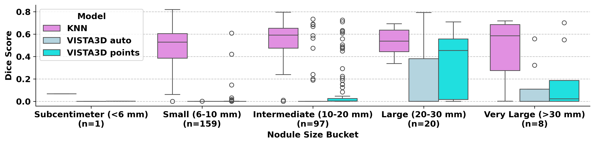

# PiNS - Point-driven Nodule Segmentation

<div align="center">
<p align="center">
  
</p>

**Medical imaging toolkit for automated pulmonary nodule detection, segmentation, and quantitative analysis**

[](https://creativecommons.org/licenses/by-nc/4.0/)
[](https://hub.docker.com/r/ft42/pins)
[](https://python.org)
[](https://simpleitk.org)
[](https://pytorch.org)
[](https://monai.io)

[🚀 Quick Start](#quick-start) • [📖 Documentation](https://github.com/fitushar/PiNS/blob/main/docs/TECHNICAL_DOCUMENTATION.md) • [💻 GitHub](https://github.com/fitushar/PiNS) 🤗 [Hugging Face](https://huggingface.co/ft42/PiNS) • [🐳 Docker Hub](https://hub.docker.com/r/ft42/pins)  

</div>

## Overview

**PiNS (Point-driven Nodule Segmentation)** is a medical imaging toolkit designed for analysis of pulmonary nodules in computed tomography (CT) scans. The toolkit provides three core functionalities:

🎯 **Automated Segmentation** - Multi-algorithm nodule segmentation with clinical validation  
📊 **Quantitative Radiomics** - 100+ standardized imaging biomarkers  
🧩 **3D Patch Extraction** - Deep learning-ready data preparation  

## Model Architecture & Algorithms

### PiNS Segmentation Workflow

``` rube
    A[CT Image + Coordinates] --> B[Coordinate Transformation]
    B --> C[ROI Extraction]
    C --> D{Segmentation Algorithm}
    D --> E[K-means Clustering]
    D --> F[Gaussian Mixture Model]
    D --> G[Fuzzy C-Means]
    D --> H[Otsu Thresholding]
    E --> I[Connected Components]
    F --> I
    G --> I
    H --> I
    I --> J[Morphological Operations]
    J --> K[Expansion (2mm)]
    K --> L[Binary Mask Output]
```

### Core Algorithms

1. **K-means Clustering** (Default)
   - Binary classification: nodule vs. background
   - Euclidean distance metric
   - Automatic initialization

2. **Gaussian Mixture Model**
   - Probabilistic clustering approach
   - Expectation-maximization optimization
   - Suitable for heterogeneous nodules

3. **Fuzzy C-Means**
   - Soft clustering with membership degrees
   - Iterative optimization
   - Robust to noise and partial volume effects

4. **Otsu Thresholding**
   - Automatic threshold selection
   - Histogram-based method
   - Fast execution for large datasets


## Quick Start

- **Sample dataset:** [https://huggingface.co/ft42/PiNS/tree/main/demofolder/data](https://huggingface.co/ft42/PiNS/tree/main/demofolder/data)

### Prerequisites
- Docker 20.10.0+ installed
- 8GB+ RAM
- 15GB+ free disk space

### Installation & Usage

```bash
# 1. Pull the Docker image (automatically handled)
docker pull ft42/pins:latest

# 2. Clone the repository
git clone https://github.com/ft42/PiNS.git
cd PiNS

# 3. Run segmentation pipeline
./scripts/DLCS24_KNN_2mm_Extend_Seg.sh

# 4. Extract radiomics features
./scripts/DLCS24_KNN_2mm_Extend_Radiomics.sh

# 5. Generate ML-ready patches
./scripts/DLCS24_CADe_64Qpatch.sh
```

### Expected Output

```
✅ Segmentation completed!
📊 Features extracted: 107 radiomics features per nodule
🧩 Patches generated: 64×64×64 voxel volumes
📁 Results saved to: demofolder/output/
```

## Input Data Requirements


### Image Specifications
- **Format**: NIfTI (.nii.gz)
- **Modality**: CT chest/abdomen/CAP scans
- **Resolution**: 0.5-2.0 mm isotropic (preferred)
- **Matrix size**: 512×512 or larger
- **Bit depth**: 16-bit signed integers
- **Intensity range**: Standard HU values (-1024 to +3071)
- **Sample Dataset:** Duke Lung Cancer Screening Dataset 2024(DLCS24)[](https://doi.org/10.5281/zenodo.13799069) 
### Annotation Format

```csv
ct_nifti_file,nodule_id,coordX,coordY,coordZ,w,h,d,Malignant_lbl
patient001.nii.gz,patient001_01,-106.55,-63.84,-211.68,4.39,4.39,4.30,0
patient001.nii.gz,patient001_02,88.69,39.48,-126.09,6.24,6.24,6.25,1
```

**Column Descriptions**:
- `coordX/Y/Z`: World coordinates in millimeters (ITK/SimpleITK standard)
- `w/h/d`: Bounding box dimensions in millimeters
- `Malignant_lbl`: Binary malignancy label (0=benign, 1=malignant)

## Output Specifications

### 1. Segmentation Masks
- **Format**: NIfTI binary masks (.nii.gz)
- **Values**: 0 (background), 1 (nodule)
- **Coordinate system**: Aligned with input CT
- **Quality**: Sub-voxel precision boundaries

### 2. Radiomics Features

**Feature Categories** (107 total features):

| Category | Count | Description |
|----------|-------|-------------|
| **Shape** | 14 | Volume, Surface Area, Sphericity, Compactness |
| **First-order** | 18 | Mean, Std, Skewness, Kurtosis, Percentiles |
| **GLCM** | 24 | Contrast, Correlation, Energy, Homogeneity |
| **GLRLM** | 16 | Run Length Non-uniformity, Gray Level Variance |
| **GLSZM** | 16 | Size Zone Matrix features |
| **GLDM** | 14 | Dependence Matrix features |
| **NGTDM** | 5 | Neighboring Gray Tone Difference |

### 3. 3D Patches
- **Dimensions**: 64×64×64 voxels (configurable)
- **Normalization**: Lung window (-1000 to 500 HU) → [0,1]
- **Format**: Individual NIfTI files per nodule
- **Centering**: Precise coordinate-based positioning

## Configuration Options

### Algorithm Selection
```bash
SEG_ALG="knn"          # Options: knn, gmm, fcm, otsu
EXPANSION_MM=2.0       # Expansion radius in millimeters
```

### Radiomics Parameters
```json
{
    "binWidth": 25,
    "resampledPixelSpacing": [1, 1, 1],
    "interpolator": "sitkBSpline",
    "labelInterpolator": "sitkNearestNeighbor"
}
```

### Patch Extraction
```bash
PATCH_SIZE="64 64 64"           # Voxel dimensions
NORMALIZATION="-1000 500 0 1"   # HU window and output range
```

## Use Cases & Applications

### 🔬 Research Applications
- **Biomarker Discovery**: Large-scale radiomics studies
- **Algorithm Development**: Standardized evaluation protocols
- **Multi-institutional Studies**: Reproducible feature extraction
- **Longitudinal Analysis**: Change assessment over time

### 🤖 AI/ML Applications
- **Training Data Preparation**: Standardized patch generation
- **Feature Engineering**: Comprehensive radiomics features
- **Model Validation**: Consistent preprocessing pipeline
- **Transfer Learning**: Pre-processed medical imaging data

## Technical Specifications

### Docker Container Details
- **Base Image**: Ubuntu 20.04 LTS
- **Size**: ~1.5 GB
- **Python**: 3.9+
- **Key Libraries**:
  - SimpleITK 2.2.1+ (medical image processing)
  - PyRadiomics 3.1.0+ (feature extraction)
  - scikit-learn 1.3.0+ (machine learning algorithms)
  - pandas 2.0.3+ (data manipulation)

### Performance Characteristics
- **Memory Usage**: ~500MB per nodule
- **Processing Speed**: Linear scaling with nodule count
- **Concurrent Processing**: Multi-threading support
- **Storage Requirements**: ~1MB per output mask

## Validation & Quality Assurance

**Evaluation Criteria:** In the absence of voxel-level ground truth, we adopted a bounding box–supervised evaluation strategy to assess segmentation performance. Each CT volume was accompanied by annotations specifying the nodule center in world coordinates and its dimensions in millimeters, which were converted into voxel indices using the image spacing and clipped to the volume boundaries. A binary mask representing the bounding box was then constructed and used as a weak surrogate for ground truth. we extracted a patch centered on the bounding box, extending it by a fixed margin (64 voxels) to define the volume of interest (VOI). Predicted segmentation masks were cropped to the same VOI-constrained region of interest, and performance was quantified in terms of Dice similarity coefficient. Metrics were computed per lesion. This evaluation strategy enables consistent comparison of segmentation algorithms under weak supervision while acknowledging the limitations of not having voxel-level annotations.

Segmentation performance of **KNN (ours PiNS)**, **VISTA3D auto**, and **VISTA3D points** ([He et al. 2024](https://github.com/Project-MONAI/VISTA/tree/main/vista3d)) across different nodule size buckets. (top) Bar plots display the mean Dice similarity coefficient for each model and size category. (buttom) Boxplots show the distribution of Dice scores, with boxes representing the interquartile range, horizontal lines indicating the median, whiskers extending to 1.5× the interquartile range, and circles denoting outliers.

<p align="center">
  
</p>

<p align="center">
  
</p>

## Limitations & Considerations

### Current Limitations
- **Nodule Size**: Optimized for nodules 3-30mm diameter
- **Image Quality**: Requires standard clinical CT protocols
- **Coordinate Accuracy**: Dependent on annotation precision
- **Processing Time**: Sequential processing (parallelization possible)


## Contributing & Development

### Research Collaborations
We welcome collaborations from:
- **Academic Medical Centers**
- **Radiology Departments** 
- **Medical AI Companies**
- **Open Source Contributors**

## Citation & References

### Primary Citation
```bibtex
@software{pins2025,
  title={PiNS: Point-driven Nodule Segmentation Toolkit },
  author={Fakrul Islam Tushar},
  year={2025},
  url={https://github.com/fitushar/PiNS},
  version={1.0.0},
  doi={10.5281/zenodo.17171571},
  license={CC-BY-NC-4.0}
}
```

### Related Publications
1. **AI in Lung Health: Benchmarking** : [Tushar et al. arxiv (2024)](https://arxiv.org/abs/2405.04605)
2. **AI in Lung Health: Benchmarking** : [https://github.com/fitushar/AI-in-Lung-Health-Benchmarking](https://github.com/fitushar/AI-in-Lung-Health-Benchmarking-Detection-and-Diagnostic-Models-Across-Multiple-CT-Scan-Datasets)
4. **DLCS Dataset**: [Wang et al. Radiology AI 2024](https://doi.org/10.1148/ryai.240248);[Zenedo](https://zenodo.org/records/13799069)
5. **SYN-LUNGS**: [Tushar et al., arxiv 2025](https://arxiv.org/abs/2502.21187)
6. **Refining Focus in AI for Lung Cancer:** Comparing Lesion-Centric and Chest-Region Models with Performance Insights from Internal and External Validation. [](https://arxiv.org/abs/2411.16823)
7. **Peritumoral Expansion Radiomics** for Improved Lung Cancer Classification. [](https://arxiv.org/abs/2411.16008)
8. **PyRadiomics Framework**: [van Griethuysen et al., Cancer Research 2017](https://pubmed.ncbi.nlm.nih.gov/29092951/)


## License & Usage
**license: cc-by-nc-4.0**
### Academic Use License
This project is released for **academic and non-commercial research purposes only**.  
You are free to use, modify, and distribute this code under the following conditions:
- ✅ Academic research use permitted
- ✅ Modification and redistribution permitted for research
- ❌ Commercial use prohibited without prior written permission
For commercial licensing inquiries, please contact: tushar.ece@duke.edu


## Support & Community

### Getting Help
- **📖 Documentation**: [Comprehensive technical docs](https://github.com/fitushar/PiNS/blob/main/docs/)
- **🐛 Issues**: [GitHub Issues](https://github.com/fitushar/PiNS/issues)
- **💬 Discussions**: [GitHub Discussions](https://github.com/fitushar/PiNS/discussions)
- **📧 Email**: tushar.ece@Duke.edu ; fitushar.mi@gmail.com

### Community Stats
- **Publications**: 5+ research papers
- **Contributors**: Active open-source community

---


